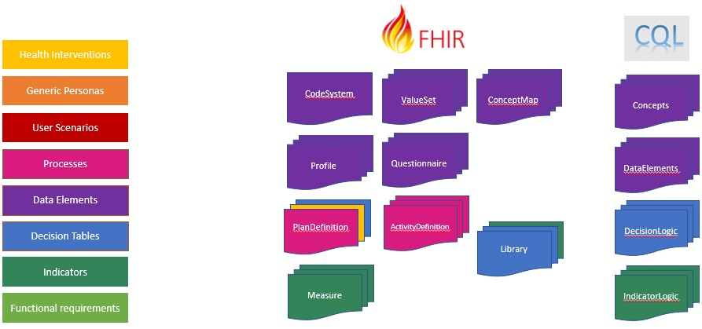
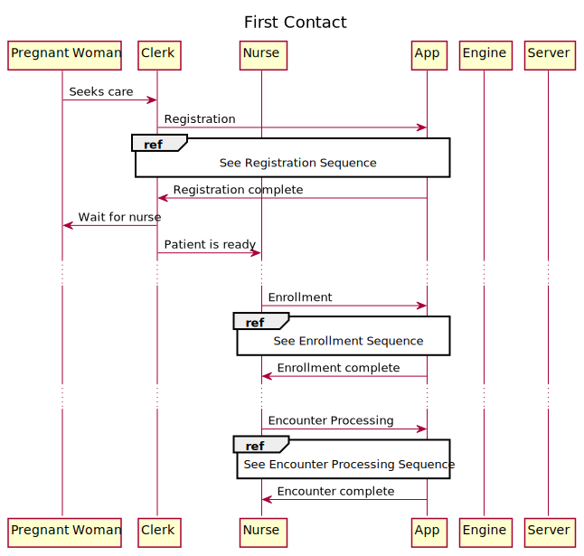
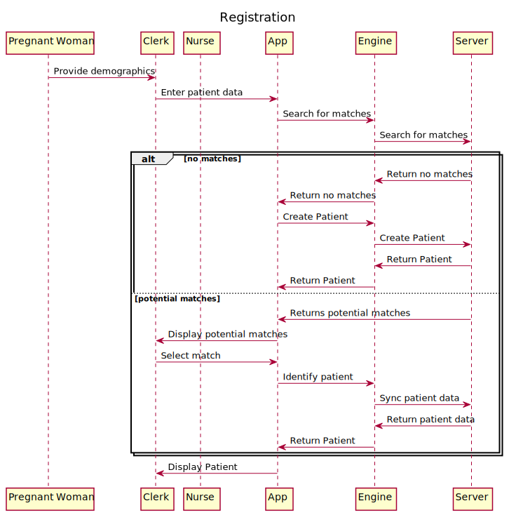
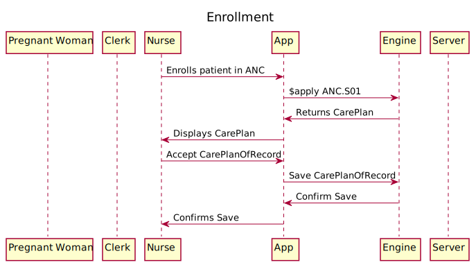
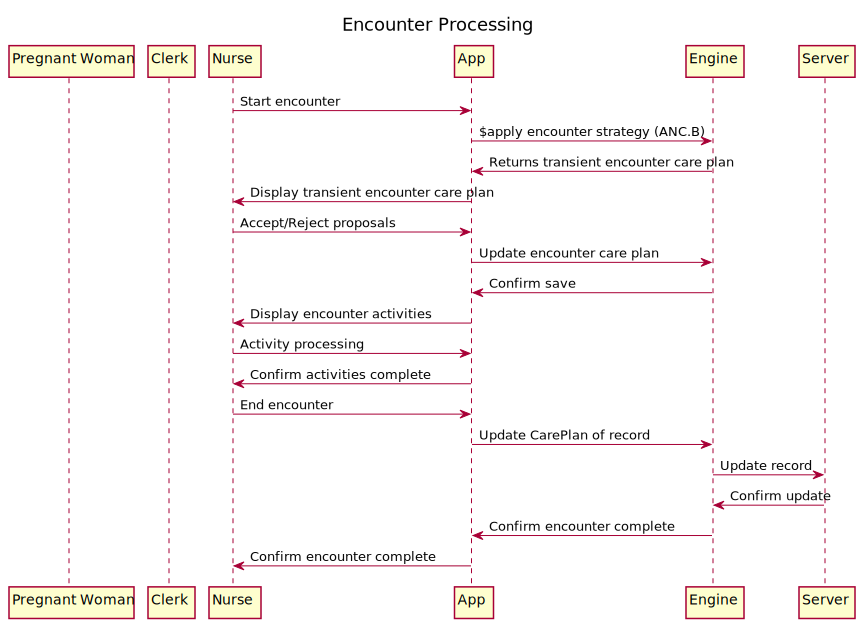
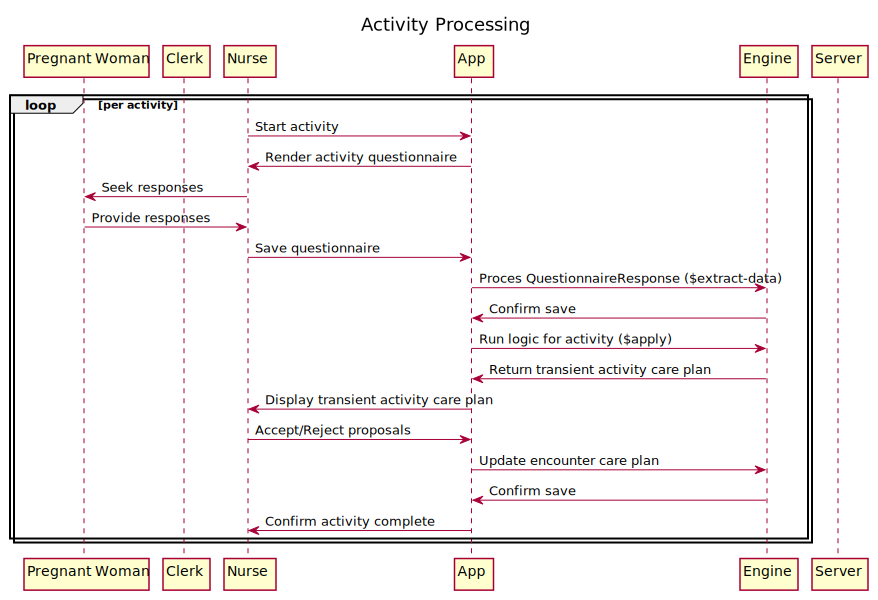
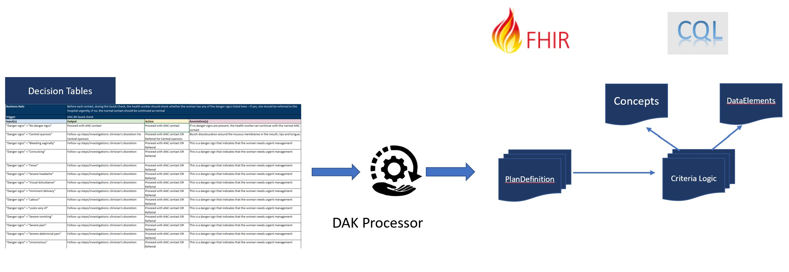

This implementation guide provides computable content based on the Digital Adaptation Kit (DAK) to facilitate the implementation of the WHO Antenatal care guidelines. The following diagram illustrates the components of a Digital Adaptation Kit and how those components are represented in FHIR:

* [**Health Interventions:**](#health-interventions) Health interventions describe the highest level guidance and recommendations of the guideline, and are represented using the CPGPathway and CPGStrategy profiles of the PlanDefinition resource.
* [**Generic Personas:**](#generic-personas) Generic personas provide a depiction of the end-users, supervisors, and related stakeholders who would be interacting with the digital system or involved in the care pathway. Generic personas are represented using profiles of the various entity resources in FHIR such as Patient, Practitioner, PractitionerRole, and RelatedPerson.
* [**User Scenarios:**](#user-scenarios) User scenarios are narratives that describe how the different personas may interact with each other, and provide illustrations and examples of typical workflows. These scenarios are represented using example resources and test cases.
* [**Processes:**](#business-processes) A business process is a set of related activities or tasks performed together to achieve the objectives of the health programme area, such as registration, counselling, and referrals. Workflows are a visual representation of activities (tasks, decision points, and interactions) that are performed within the business process. Processes are represented using the CPGStrategy profile of the PlanDefinition, and activities are represented using the CPGActivityDefinition profile. In addition, the CPG-on-FHIR IG describes the types of activities that can be represented, and provides a common process to allow content from different guidelines to establish common entry points and steps across guidelines.
* [**Data Elements:**](#data-elements) The data dictionary provides a description of the data elements required throughout the guideline, as well as a mapping of those data elements to standard terminologies such as ICD, SNOMED CT, and LOINC. Data elements are represented using a combination of the CodeSystem, ValueSet, StructureDefinition (profiles and extensions), and Questionnaire resources.
* [**Decision Tables:**](#decision-support-logic) Decision tables provide decision support logic and algorithms to support appropriate service delivery in accordance with WHO clinical, public health, and data use guidelines. Decision tables are represented using the CPGRecommendationDefinition profile of the PlanDefinition resource, as well as CQL libraries to provide a computable representation of the rule logic.
* [**Indicators:**](#indicators) Indicators provide a core set of indicators that need to be aggregated for decision-making, performance metrics, and subnational and national reporting. The indicators and metrics are based on data that can feasibly be captured from a routine digital system, rather than survey-based tools. Indicators are represented using the CPGMetric profile of the Measure resource, as well as CQL libraries to provide a computable representation of the indicator criteria.
* [**Functional Requirements:**](#functional-requirements) Functional and non-functional requirements provide a listing of the core functions and capabilities the system must have to meet the end-users' needs and achieve tasks within the business process. These requirements can potentially be represented using CapabilityStatement (_future work_).

### Health Interventions
The key interventions for routine antenatal care (ANC) are the following, as defined in the WHO UHC compendium of essential interventions:

Health interventions are represented using _strategy_ and _pathway_ artifacts:

|Code|Description|Artifact|
|---|---|---|
|ANC.INT.01|Health education and counselling to promote healthy pregnancy|_future work_|
|ANC.INT.02|Nutritional supplementation during pregnancy|_future work_|
|ANC.INT.03|Maternal and fetal assessment and screening during pregnancy|_future work_|
|ANC.INT.04|Preventive measures and vaccination during pregnancy|_future work_|
|ANC.INT.05|Treatment for physiological symptoms during pregnancy|_future work_|
|ANC.INT.06|Antenatal care models with a minimum of eight contacts|[ANC.S01](PlanDefinition-ANCS01.html)|

Note that although this implementation does not include high-level representations of many of these interventions, the decision support logic included as part of the routine contact provides an implementation of these health interventions.

### Generic Personas

A _persona_ is a depiction of a relevant stakeholder, or "end-user", of the system. Personas are represented with profiles of the appropriate FHIR resource, as depicted in the following table:

|Occupational title|Description|ISCO code|Profile|
|---|---|---|---|
|Auxilliary nurse midwife (ANM)|Auxiliary nurse midwives (ANMs) assist in the provision of maternal and newborn health care, particularly during childbirth but also in the prenatal and postpartum periods.|3221 (Nursing associate professional) 3222 (Midwifery associate professional)|[ANCPractitionerRole](StructureDefinition-anc-practitionerrole.html)|
|Midwife|A person who has been assessed and registered by a state midwifery regulatory authority or similar regulatory authority.|2222 (Midwifery professional)|[ANCPractitionerRole](StructureDefinition-anc-practitionerrole.html)|
|Nurse|A graduate who has been legally authorized (registered) to practise after examination by a state board of nurse examiners or similar regulatory authority.|2221 (Nursing professional)|[ANCPractitionerRole](StructureDefinition-anc-practitionerrole.html)|
|Pregnant woman|Pregnant women are the primary clients receiving antenatal care (ANC) services from the targeted health worker personas.|N/A|[ANCPatient](StructureDefinition-anc-patient.html)|
|Adolescent client|Adolescent clients require additional decision support logic|N/A|[ANCPatient](StructureDefinition-anc-patient.html)|
|Lay health worker|Any health worker who performs functions related to health-care delivery, was trained in some way in the context of the intervention but has received no formal professional or paraprofessional certificate or tertiary education degree.|3259 (Health associate professionals not elsewhere classified)|[ANCPractitionerRole](StructureDefinition-anc-practitionerrole.html)|
|Community health worker|Community health workers provide health education, referral and follow-up; case management and basic preventive health care; and home visiting services to specific communities. They provide support and assistance to pregnant women and their families in navigating the health and social services system.|3253 (Community health workers)|[ANCPractitionerRole](StructureDefinition-anc-practitionerrole.html)|

NOTE: There are other personas in the Digital Adaptation Kit (Nurse/Midwife supervisor, Facility Manager) that are not represented here.

See the [ANC Personas](CodeSystem-anc-persona.html) code system for complete definitions.

### User Scenarios
User scenarios are a narrative description of how different personas would interact with each other. The user scenario is provided to help the reader better understand how the system will be used and how it would fit into existing workflows. The following illustrative examples provide scenarios that may be common within ANC. In the subsequent component on workflows, these types of scenarios will be presented in a visual diagram, as opposed to narrative form. Note: these scenarios are not exhaustive and are only intended to contextualize the workflows in Component 4.

User scenarios within this implementation guide are represented with ExampleScenario resources.

#### User scenario for first antenatal care contact

[First Contact Example Scenario](examples-first-contact.html)

#### User scenario for second antenatal care contact

[Second Contact Example Scenario](examples-second-contact.html)

#### User scenario for an adolescent client

[Adolescent Example Scenario](examples-adolescent.html)

### Business Processes

|Label|Process name|Process ID|Artifact|
|---|---|---|---|
|A|Registration|ANC.A|[CPGCommonRegistration](http://hl7.org/fhir/uv/cpg/PlanDefinition-cpg-common-registration.html)|
|B|Routine ANC Contact|ANC.B|[ANC.B Routine Contact](PlanDefinition-ANCB.html)|
|C|ANC referral|ANC.C|_future work_|
|D|ANC health promotion, follow-up in the community|ANC.D|_future work_|
|E|Reporting on aggregate indicators|ANC.E|_future work_|

NOTE: C, D, and E are not yet specified by this implementation guide

#### Routine ANC Contact

Each of these steps will have data requirements that are either met/unmet, and a corresponding questionnaire (either explicitly specified, or derived from missing/incomplete data requirements) to be used as an interface for completing the activity. Each of the steps here are mapped to one of the common process codes in [CPGCommonProcess](http://build.fhir.org/ig/HL7/cqf-recommendations/CodeSystem-cpg-common-process.html):

1. Rapid assessment and management (RAM)
2. Danger signs needing referral?
3. Confirm pregnancy
4. First contact
5. Quick check
6. Profile
7. Check symptoms and follow-up
8. Conduct physical exam
9. Conduct laboratory test and imaging
10. Counselling, in-facility management and treatment
11. Urgent referral?
12. Scheduling
13. Self-care in the home or community

NOTE: Steps 1 and 2 are expected to be performed as part of the registration process and are
not modeled in the routine contact.

#### Sequence Diagrams

The following sequence diagrams illustrate the processing that occurs in a typical first contact scenario. The actors are:

* **Pregnant Woman**: The pregnant woman generic persona, a client that is a pregnant woman seeking antenatal care
* **Clerk**: The clerk generic persona, a registration clerk at the clinic
* **Nurse**: The nurse generic persona, a clinical professional at the clinic
* **App**: The primary application that the users interact with
* **Engine**: The engine component of the digital system that implements the business processes and logic of the Antenatal care guideline
* **Server**: A central repository of shared patient records. This may be scoped to the local clinic, or it may be a more broadly implemented repository. From the perspective of these sequences, it is a repository that is expected to contain the longitudinal record for patients seen at this clinic.

The First Contact sequence illustrates the overall processing and high-level steps:

The Registration sequence illustrates the process of identifying and potentially creating the patient record, syncing that data with a clinical data repository, and collecting initial information from the pregnant woman:

The Enrollment sequence illustrates the process that a Nurse uses to manually enroll the patient in the Antenatal care pathway, establishing the Care Plan of Record:

The Encounter Processing sequence illustrates the process of starting an encounter and establishing the activities to be performed based on the Routine Contact strategy:

The Activity Processing sequence illustrates the general process of performing activities within the encounter. For each activity, the decision logic associated with that activity provides proposed activities based on the guideline:

### Data Elements

Data elements are represented within this implementation guide using FHIR profiles of the appropriate resource as well as libraries of associated calculation logic for calculated, or inferred, data elements.

Note that some "Data elements" from the perspective of the Data Dictionary presented in the DAK are actually rollups. For example, Patient last name is a specific data element within the DAK, but is represented as one of many elements in the ANCPatient profile.

#### Data Element Processing

The following diagram illustrates the processing used to derive FHIR terminology and profile resources from the data dictionary:

The inputs on the left consist of:

1. Data elements in the data dictionary, defining a unique _label_ for each, along with other metadata such as definition, data type, and input options.
2. Terminology mappings for each element to several standard terminologies, including SNOMED, LOINC, and ICD-10 and -11.
3. FHIR mappings for each element, establishing a path to a FHIR resource type and element, as well as a base profile and establishing contexts for the element

NOTE: The FHIR mappings are not part of the Digital Adaptation Kit, but are introduced as part of this implementation guide. The WHO_ANC.xlsx spreadsheet in the `input/l2` folder is the source for these mappings, and was created by copying the WHO_ANC spreadsheet from the Digital Adaptation Kit, and then adding the FHIR mapping columns and providing the individual data element mappings.

The outputs on the right consist of:

1. **CodeSystem:** An ANC-specific code system that contains concepts for each element and input option in the data dictionary
2. **ConceptMap:** Mappings from each code in the ANC-specific code system to the various standard terminologies
3. **ValueSet:** Valuesets for each data element concept and the possible values for that concept
4. **Profile:** StructureDefinition resources for the profiles (and any necessary extensions) to represent the data elements as FHIR resources
5. **Questionnaire:** Questionnaire resources, one for each activity, with questions for each data element used by the activity
6. **Concepts (cql):** A Concepts CQL library with declarations for each value set (each data element concept and the possible values for it)
7. **DataElements (cql):** A DataElements CQL library from both the Patient and Encounter perspectives, keyed by the _label_ of each data element.

Separating the Concepts CQL allows the domain-friendly name for each concept and answer set to be referenced by that name within the logic. This pattern also allows implementations to easily vary implementation by providing alternate versions of the Concepts library with their own definitions for the value sets, supporting local adaptation.

Separating the Patient and Encounter perspectives of the DataElements libraries allows the same data elements to be used from different contexts, depending on the use case. For example, when referenced from decision support logic, the Encounter perspective is typically used, whereas from indicator logic, the Patient perspective is typically used.

#### Data Model

The model for data elements represented within this implementation guide is based on the following profiles. All the data elements defined derive from one of these profiles, and all data used within smart content and related decision support rules and health metrics use these profiles, or profiles that are derived from them:

|Profile|
|---|
|[ANC Allergy/Intolerance](StructureDefinition-anc-allergyintolerance.html)|
|[ANC Appointment](StructureDefinition-anc-appointment.html)|
|[ANC CarePlan](StructureDefinition-anc-careplan.html)|
|[ANC CareTeam](StructureDefinition-anc-careteam.html)|
|[ANC Condition](StructureDefinition-anc-condition.html)|
|[ANC EpisodeOfCare](StructureDefinition-anc-episodeofcare.html)|
|[ANC Encounter](StructureDefinition-anc-encounter.html)|
|[ANC Group](StructureDefinition-anc-group.html)|
|[ANC Immunization](StructureDefinition-anc-immunization.html)|
|[ANC ImmunizationNotDone](StructureDefinition-anc-immunizationnotdone.html)|
|[ANC Location](StructureDefinition-anc-location.html)|
|[ANC MeasureReport](StructureDefinition-anc-measurereport.html)|
|[ANC MedicationRequest](StructureDefinition-anc-medicationrequest.html)|
|[ANC MedicationNotRequested](StructureDefinition-anc-medicationnotrequested.html)|
|[ANC Observation](StructureDefinition-anc-observation.html)|
|[ANC ObservationNotDone](StructureDefinition-anc-observationnotdone.html)|
|[ANC Organization](StructureDefinition-anc-organization.html)|
|[ANC Patient](StructureDefinition-anc-patient.html)|
|[ANC Practitioner](StructureDefinition-anc-practitioner.html)|
|[ANC PractitionerRole](StructureDefinition-anc-practitionerrole.html)|
|[ANC Procedure](StructureDefinition-anc-procedure.html)|
|[ANC ProcedureNotDone](StructureDefinition-anc-procedurenotdone.html)|
|[ANC RelatedPerson](StructureDefinition-anc-relatedperson.html)|
|[ANC ServiceRequest](StructureDefinition-anc-servicerequest.html)|
|[ANC ServiceNotRequested](StructureDefinition-anc-servicenotrequested.html)|

#### Data Elements by Activity

The following index lists all data elements, grouped by their activity:



<!--
#### Data elements by profile

TODO
-->

### Decision-support Logic

Decision tables within this implementation guide are represented with a combination of recommendation definitions and libraries of associated criteria logic.

#### Decision-table Processing

The following diagram illustrates the processing used to derive decision support rules and logic from the decision tables:

The input on the left consists of decision tables included in the Digital Adaptation Kit.

The output on the right consists of:

1. PlanDefinition resources conforming to the CPGRecommendationDefinition profile, one for each decision table. Each PlanDefinition contains:
    1. An action for each unique action in the decision table
    2. A definition for the criteria associated with the action
2. CQL Library files that reference the Concepts and DataElements CQL libraries produced by the data dictionary processing. Each file contains an empty definition for each condition of each action, named with the description of the action, and a comment with the combined pseudo code for the conditions for that action.

Because the pseudo-code for the criteria in the decision table is expressed in terms of the labels for the data elements, a knowledge-engineer can easily take the pseudo-code, and by referencing the expressions from the DataElements libraries, construct the CQL for the condition logic.

#### Plan Definition Index



### Indicators

This section details indicators and performance metrics that would be aggregated from core data elements identified in Component 5. These indicators are based on the Global ANC monitoring framework (25) and the WHO–UNICEF guidance for RMNCAH programme managers on the analysis and use of health facility data (10). These indicators may be aggregated automatically from the digital tracking tool to populate a digital HMIS, such as DHIS2.

Indicator definitions are represented using the FHIR Measure resource (CPGMetric profile).

|Indicator ID|Title|Artifact|Reference|
|---|---|---|---|
|ANC.IND.01|Percentage of pregnant women with first ANC contact in the first trimester (before 12 weeks of gestation)|[ANC.IND.01](Measure-ANCIND01.html)|Global ANC monitoring framework (25) WHO–UNICEF guidance for RMNCAH programme managers on the analysis and use of health facility data (10)|
|ANC.IND.02|Percentage of pregnant women who received iron and folic acid (IFA) supplements for 90+ days|[ANC.IND.02](Measure-ANCIND02.html)|Global ANC monitoring framework (25)|
|ANC.IND.03|Percentage of pregnant women screened for syphilis during ANC|[ANC.IND.03](Measure-ANCIND03.html)|Global ANC monitoring framework (25) WHO–UNICEF guidance for RMNCAH programme managers on the analysis and use of health facility data (10)|
|ANC.IND.04|Percentage of pregnant women with at least four ANC contacts|[ANC.IND.04](Measure-ANCIND04.html)|Global ANC monitoring framework (25) WHO–UNICEF guidance for RMNCAH programme managers on the analysis and use of health facility data (10)|
|ANC.IND.05|Percentage of pregnant women with a minimum of eight antenatal care contacts|[ANC.IND.05](Measure-ANCIND05.html)|Global ANC monitoring framework (25) WHO–UNICEF guidance for RMNCAH programme managers on the analysis and use of health facility data (10)|
|ANC.IND.06|Pregnant women who received counselling on danger signs (%) during at least one ANC contact|[ANC.IND.06](Measure-ANCIND06.html)|Global ANC monitoring framework (25) WHO–UNICEF guidance for RMNCAH programme managers on the analysis and use of health facility data (10)|
|ANC.IND.07|Percentage of pregnant women with at least one blood pressure measure during ANC|[ANC.IND.07](Measure-ANCIND07.html)|Global ANC monitoring framework (25) WHO–UNICEF guidance for RMNCAH programme managers on the analysis and use of health facility data (10)|
|ANC.IND.08|Percentage of pregnant women with at least one blood pressure measure in the third trimester during ANC|[ANC.IND.08](Measure-ANCIND08.html)|Global ANC monitoring framework (25)|
|ANC.IND.09|Percentage of pregnant women whose baby’s heartbeat was listened to at least once during ANC|[ANC.IND.09](Measure-ANCIND09.html)|Global ANC monitoring framework (25)|
|ANC.IND.10|Percentage of pregnant women with an ultrasound scan before 24 weeks|[ANC.IND.10](Measure-ANCIND10.html)|Global ANC monitoring framework (25)|
|ANC.IND.11|Percentage of women who received three doses or more of intermittent preventive therapy for malaria (IPTp) during their last pregnancy|[ANC.IND.11](Measure-ANCIND11.html)|Global ANC monitoring framework (25) WHO–UNICEF guidance for RMNCAH programme managers on the analysis and use of health facility data (10)|
|ANC.IND.12|Percentage of pregnant women counselled and tested for HIV|[ANC.IND.12](Measure-ANCIND12.html)|Global ANC monitoring framework (25) WHO–UNICEF guidance for RMNCAH programme managers on the analysis and use of health facility data (10)|
|ANC.IND.13|Percentage of pregnant women who received oral pre-exposure prophylaxis (PrEP)|[ANC.IND.13](Measure-ANCIND13.html)|Global ANC monitoring framework (25)|

### Functional requirements

Functional requirements are specified in the Digital Adaptation Kit. Future work may involve specifying these requirements as CapabilityStatement resources, depending on feedback from the implementation community.
